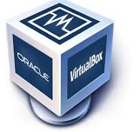

# Deliverable 1 Submission

## Basic Terminology

### What is a web server?
A web server is a computer that stores web server software and a website's component files. It connects to the internet. A web server includes several parts which access hosted files. An example of this is an http server. An http server is a software that understands URLs. 

### What is Apache?
An open-source web server that is used around the world. It is a very flexible application which allows for efficient handling of connections at the same time. It has support for SSL/TLS encryption which ensures a secure communication.
### What are some example web server applications?

| Application Name | license                   | Project's Website                       |
| ---------------- | ------------------------- | --------------------------------------- |
| IIS              | Windows Operating Systems | [IIS](https://www.iis.net/)             |
| NGINX            | NGINX Open-Source License | [NGINX](https://www.nginx.com/)         |
| Lighthttpd       | BSD License               | [Lighthttpd](https://www.lighttpd.net/) |

#### IIS
 
Internet Information Services is a web server developed by Microsoft for hosting websites on Windows servers. It offers features like HTTP/2 support and has smooth integration with Microsoft's technology. IIS is widely used in enterprise environments for it's compatibility with many other systems.

#### NGINX
 
A high performance open-source web server and also a reverse proxy server. This means it works together with other web servers such as Apache. The server was developed to handle hundreds of connections at once, which delivers better performance. It is meant to be a balanced server to handle loads for heavy applications.

#### Lighthttpd
 
An uncommon web server for public sites on the internet. The biggest advantage with this server is that its very light and uses a very low amount of memory, CPU, and disk space.

### What is virtualization?
A technology that creates virtual instances of computer hardware, operating systems, storage devices, or networks. Virtualization allows multiple environments to run at the same time by using physical resources. This all runs on what is called a host, which is the physical machine. 

### What is virtualbox?
 
An open-source platform made by Oracle. It allows users to run multiple guest operating systems on a single host machine. 

### What is a virtual machine?
Virtual machines are software-based simulations of physical computers. They enable users to run multiple operating systems on a single machine. 

### What is Ubuntu Server?
 
A variant of the Ubuntu Linux distribution made for server environments. It offers a secure platform for hosting websites. It receives regular updates and has a large repository of software packages. It provides tools for system management, security, and virtualization. These features make it suitable for a wide range of server workloads.

### What is a firewall?
A network security device that monitors and controls incoming and outgoing network traffic based on predetermined rules. It is a barrier between a trusted internal network and an untrusted external network.

### What is SSH?
Stands for Secure Shell. It is a cryptographic network protocol that allows for secure communication between two computers over an unsecured network. It provides encrypted connections for secure remote login. SSH authentication usually involves passwords. SSH is an essential tool for secure remote access and administration.

## Other Relevant Concepts
* **Systemd**
A system and service manager for Linux OS. It is designed to manage the startup process. It is known for its parallelization capabilities and integration with modern features.
* **Systemctl**
A command-line utility in Linux that serves as a central tool for managing system services. It is part of the systemd suite and provides a united interface for controlling services. 
* **Virtual hosts**
A feature of web servers that allow a single single physical server to host multiple physical websites. Each virtual host has a unique domain name or IP address. This enables the server to distinguish between incoming requests and route them to the appropriate them to the appropriate web directory.
* **Log file**
A text file that contains records of events, actions, or messages that are generated by a software application or operating system. The records are known as log entries. They typically include timestamps, event descriptions, and error messages.