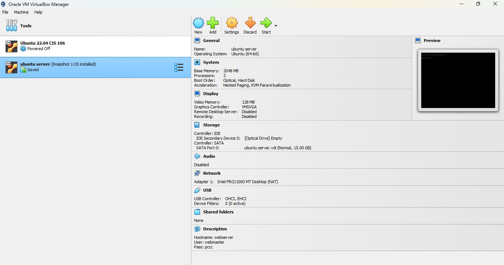
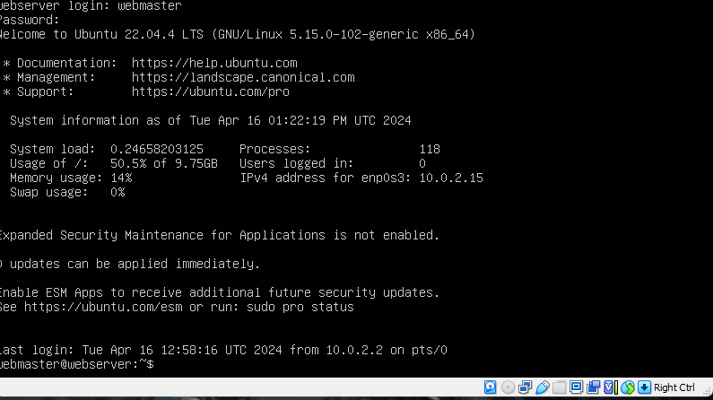
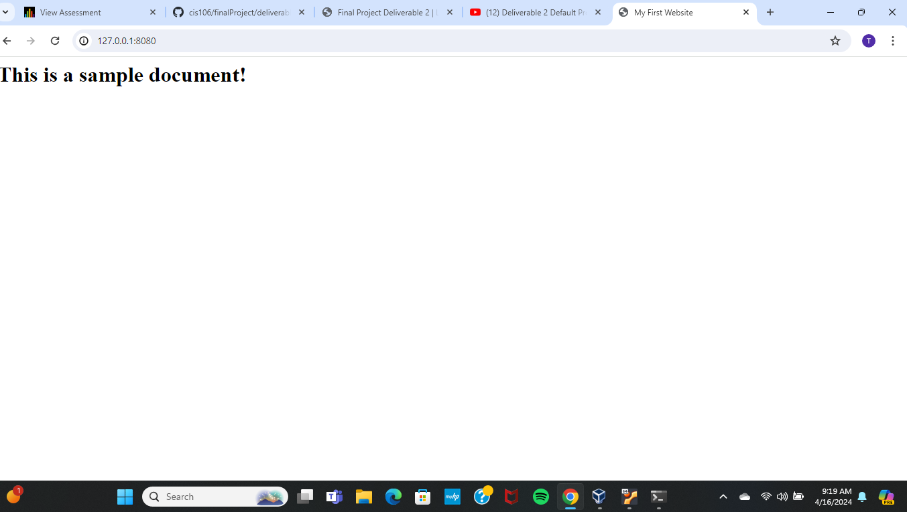

# Deliverable 2 Submission

## Server Specifications

## Ubuntu Login Screen

## Sample Website

## Questions
3. **What is the IP address of your Ubuntu Server Virtual Machine?**
 127.0.0.1:8080  
4. **How do you enable the Ubuntu Firewall?**
 sudo ufw enable
5. **How do you check if the Ubuntu Firewall is running?**
 sudo ufw status  
6. **How do you disable the Ubuntu Firewall?**
 sudo ufw disable 
7. **How do you add Apache to the Firewall?** 
 sudo ufw allow 'Apache'  
8. **What is the command you used to install Apache?**
 sudo apt install apache2 -y 
9.  **What is the command you use to check if Apache is running?**
 systemctl status apache2 --no-pager  
10. **What is the command you use to stop Apache?**
 sudo systemctl stop apache2   
11. **What is the command you use to restart Apache?**
 sudo systemctl start apache2   
12. **What is the command used to test Apache configuration?**
 sudo apache2ctl configtest  
13. **What is the command used to check the installed version of Apache?**
 apache2 -v
14. **What are the most common commands to troubleshoot Apache errors? Provide a brief description of each command.**
 * apachectl configtest: This command checks the Apache configuration and files for syntax errors. 

* apachectl -t:  this command also checks the Apache configuration for syntax errors. It's used to test the configuration before actually  restarting Apache.

* tail /var/log/apache2/error.log: This command displays the last few lines of the Apache error log file. 
15.  **Which are Apache Log Files, and what are they used for? Provide examples and screenshots.**
* Access Log:/var/log/apache2/access.log
* Error Log:/var/log/apache2/error.log 
* SSL Access Log:/var/log/apache2/ssl_access.log
* SSL Error Log:/var/log/apache2/ssl_error.log