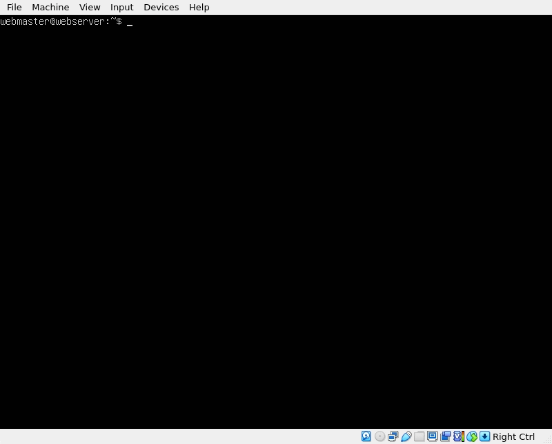
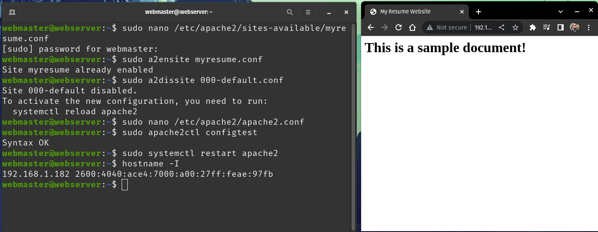

# How to Setup a Web Server in VirtualBox and Ubuntu Server 

## Introduction 
These are the instructions and basic summaries on all the essential components to create and host a simple site on a web server. Included in these components are the use of Virtualbox, Ubuntu, Apache, SSH, and Firewalls.

## Basic terminology that the reader must know

### Virtualbox
 
An open-source platform made by Oracle. It allows users to run multiple guest operating systems on a single host machine.

### Ubuntu
 
A variant of the Ubuntu Linux distribution made for server environments. It offers a secure platform for hosting websites. It receives regular updates and has a large repository of software packages. It provides tools for system management, security, and virtualization. These features make it suitable for a wide range of server workloads.

### Apache
 
An open-source web server that is used around the world. It is a very flexible application which allows for efficient handling of connections at the same time. It has support for SSL/TLS encryption which ensures a secure communication.

### SSH
 
Stands for Secure Shell. It is a cryptographic network protocol that allows for secure communication between two computers over an unsecured network. It provides encrypted connections for secure remote login. SSH authentication usually involves passwords. SSH is an essential tool for secure remote access and administration.

### Firewall
 
A network security device that monitors and controls incoming and outgoing network traffic based on predetermined rules. It is a barrier between a trusted internal network and an untrusted external network.

## Step-by-step instructions
### Part 1 Virtual Machine

Minimum requirements are 2 GBs of RAM and 5 GBs of Disk space

### Part 2 Install Ubuntu Server
* Install Ubuntu server 20.04 file

* Create a virtual machine that meets the minimum requirements
* Turn on the virtual machine
* Start the installer
* Choose a server name, username, and password

### Part 3 Install Apache
`sudo apt update`
`sudo apt install apache2 -y`

### Part 4 Setup SSH
To enable the firewall
* `sudo ufw enable`
* `sudo ufw allow 'Apache`
* `sudo ufw allow 'OpenSSH'`
To check the status of the firewall
* `sudo ufw status`
To make sure if Apache and SSH are running
* `systemctl status apache2 --no-pager`
* `systemctl status ssh --no-pager`
If the commands do not say "running"
`sudo systemctl restart apache2 ssh`

### Part 5 Setup virtual hosts
Create the directory for mywebsite as follows:
`sudo mkdir /var/www/mywebsite`

Modify the ownership of mywebsite so that it is now owned by your user instead of root
`sudo chown -R $USER:$USER /var/www/mywebsite`

Now let’s change the file permission so that the owner can read, write, and execute the files while granting only read and execute permissions to groups and others:
`sudo chmod -R 755 /var/www/mywebsite`

We can now create a simple html document to be served from our new virtual host. Create a document with the nano text editor called index.html in the `/var/www/mywebsite/` directory:
`sudo nano /var/www/mywebsite/index.html.`

Once the new document opens, type the following text:
<html>
    <head>
        <title>My First Website</title>
    </head>
    <body>
        <h1>This is a sample document!</h1>
    </body>
</html>

Save and close the file when you are finished. 

We need to create a virtual host file so that this new content can be served. The default configuration is located in `/etc/apache2/sites-available/000-default.conf`

 However, we do not need to touch this file, we can instead create a new one as it is best practice. To create a new config file, we are going to use nano again:
`sudo nano /etc/apache2/sites-available/mywebsite.conf`

Add the following text to the domain config file:

<VirtualHost *:80>
    ServerAdmin webmaster@localhost
    ServerName mywebsite
    ServerAlias www.mywebsite
    DocumentRoot /var/www/mywebsite
    ErrorLog ${APACHE_LOG_DIR}/error.log
    CustomLog ${APACHE_LOG_DIR}/access.log combined
</VirtualHost>

Save and close the file when you are finished.

Now you can enable the site with the following command:
`sudo a2ensite mywebsite.conf`

Now lets disable the default domain:
`sudo a2dissite 000-default.conf`

Before we can refresh the configuration, we need to add a configuration line to the `apache2.conf` file. Open the file in nano:
`sudo nano /etc/apache2/apache2.conf`

Add the following line at the end of the file:
`ServerName 127.0.0.1`

Save and close the file when you are finished. 
Now you can test the configuration for errors:
`sudo apache2ctl configtest`

The output of the command should look like this:
`Syntax OK`

If there are no errors, restart Apache to apply the changes:
`sudo systemctl restart apache2`

Now, if you open a web browser in your host computer and go the URL: `http://ip.address.of.your.server/` your `index.html` document should load.

